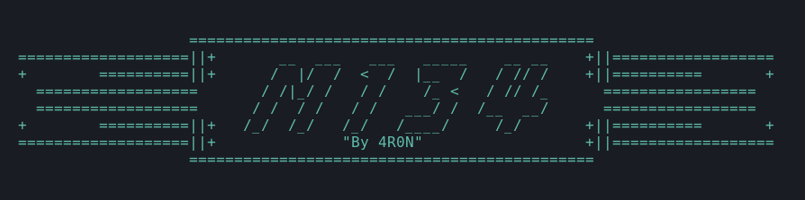

 

  

  <h3 align="center">M134</h3>

  M134 - The Weapon you need.

## Table of Contents

- [Table of Contents](#table-of-contents)
- [About M134](#about-M134)
- [Features](#features)
- [Usage](#usage)
  - [Prerequisites](#prerequisites)
  - [Option 1 - Use the github repository](#option-1---use-the-github-repository)
  - [Option 2 - Use the image from docker hub](#option-2---use-the-image-from-docker-hub)
- [Coffee Time](#coffee-time)
- [Credits](#credits)
- [Disclaimer](#disclaimer)
- [License](#license)

## About M134

M134 is a suite of automated reconnaissance tools used for enumeration and discovery in infromation gathering phase of penetration testing. Its written in bash script and executable on Docker.

## Features

- Subdomain Enumeration
- Checks alive subdomain
- Finds URLs at Wayback Machine
- Screenshots of the subdomains
- Headers responses files
- Finds js files
- Search tokens in js files
- Search endpoints in js files
- Finds parameters
- Finds directories

## Elements of M134

| **Name**          | **Repository**                                        |
| ----------------- | ----------------------------------------------------- |
| findomain         |  https://github.com/Edu4rdSHL/findomain               |                                     
| assetfinder       |  https://github.com/tomnomnom/assetfinder             |                                               
| Amass             |  https://github.com/OWASP/Amass                       |                                              
| httprobe          |  https://github.com/tomnomnom/httprobe                |
| waybackurls       |  https://github.com/tomnomnom/waybackurls             |
| aquatone          |  https://github.com/michenriksen/aquatone             |
| subjs             |  https://github.com/lc/subjs                          |
| new-zile          |  https://github.com/bonino97/new-zile                 |    
| LinkFinder        |  https://github.com/GerbenJavado/LinkFinder           |
| paramspider       |  https://github.com/devanshbatham/ParamSpider         |
| dirsearch         |  https://github.com/maurosoria/dirsearch              |

## Usage
### Prerequisites

- Install [Docker](https://docs.docker.com/get-docker/).

This tool can be run in below two ways:

### Way 1 - Using this github repo

To build the container yourself manually, git clone the repo, then build and run the following commands

    Step 1: git clone --depth 1 https://github.com/4RON-IN/M134.git
    Step 2: cd M134
    Step 3: docker build -t M134 .   #(Build your docker container)
    Step 4: docker run --rm -it -v /path/to/local/directory:/mainData M134 -p [--program] <google> -t [--target] google.com     #(After building the container, run it)

Also, If you have access token for run findomain. You must configure the Dockerfile ("ENTER_TOKEN_HERE").

    Typical command looks like this:
    docker run --rm -it -v /home/kali/M134:/mainData M134 -p google -t google.com
    

### Way 2 - Running directly from docker hub

Use image from docker hub: [4RON-IN/M134](https://hub.docker.com/u/4RON-IN/M134)

    Running without access tokens:
    docker pull 4RON-IN/M134
    docker run --rm -it -v /path/to/local/directory:/mainData --name M134 4RON-IN/M134 -p [--program] <google> -t [--target] google.com
    
    
    If you have access token then follow this:
    docker pull 4RON-IN/M134
    docker run --rm -it --env findomain_fb_token="fb_token" \
    --env findomain_spyse_token="spyse_token" \
    --env findomain_virustotal="virustotal_token" \
    --env findomain_securitytrails_token="securitytrails_token" \
    -v /path/to/local/directory:/mainData --name M134 4RON-IN/M134 -p [--program] <google> -t [--target] google.com

## Coffee Time

If you like my content, please consider inviting me to a coffee. Thank you for your support!

## Credits

M134 suite of tools was possible because of these guys. Thank you to the following projects.

- [Edu4rdSHL](https://github.com/Edu4rdSHL)                                             
- [tomnomnom](https://github.com/tomnomnom/)         
- [OWASP](https://github.com/OWASP/)               
- [michenriksen](https://github.com/michenriksen/)
- [GerbenJavado](https://github.com/GerbenJavado/)
- [devanshbatham](https://github.com/devanshbatham/)
- [subjs](https://github.com/lc/subjs/)
- [maurosoria](https://github.com/maurosoria/)
- [SubEnum](https://github.com/bing0o/SubEnum)
- [aaaguirre](https://github.com/aaaguirrep/pentest)
- [l34r00t](https://github.com/l34r00t)

## Disclaimer

- M134 was written for education purposes only. You are responsible for your actions. Developers assume no liability and are not responsible for any misuse or damage.

## License

[MIT](LICENSE)
Copyright (c) 2022, 4RON-IN
